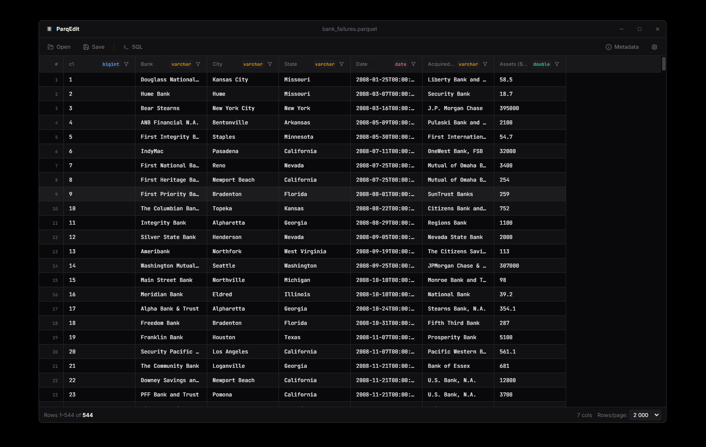

# ParqEdit

Desktop Parquet viewer and editor for quickly inspecting, querying, and editing Parquet and CSV files without writing Python scripts.

I built ParqEdit because working with Parquet files should not require a pile of one-off Python scripts just to inspect, edit, or understand your data. It started as a fix for my own annoying little workflow problems, and I hope it helps anyone who has felt the same.

**[parqedit.com](https://parqedit.com)** · [Download](../../releases/latest) · [Issues](../../issues)



## Features

- **Instant open** — large files load in seconds via DuckDB's columnar engine
- **View & edit** — double-click any cell to edit values inline
- **Sort & filter** — click column headers to sort; per-column value filters
- **SQL mode** — run arbitrary SQL queries directly against the open file
- **Column resize** — drag column borders to adjust widths; hover headers for full name tooltip
- **Row/column selection** — click row numbers or column headers to select ranges; Ctrl+C copies as TSV (Excel-compatible)
- **Multi-window** — drag a second file onto the window to open it side-by-side in a new window
- **File association** — set ParqEdit as the default app for `.parquet` files; double-clicking opens directly
- **Dark / light theme** — follows system preference, toggleable in settings
- **Export** — save the current view (with any edits or SQL results) back to Parquet or CSV

## What’s next

Some things I’m planning or thinking about:

- [ ] Drag and drop files (it's more of a bug fix than a new feature. it's already there in the code, but no working properly)
- [ ] Connect to AWS S3 buckets (would be nice to have this for my work; request or feel free to add other DBs if you need)
- [ ] Better error logs.
- [ ] Query history
- [ ] Add compression options for parquet
- [ ] Creating a new parquet
- [ ] More export options
- [ ] Improve UI. I was more focused on what's happening under the hood, so used Claude to quickly generate the UI. Would be nice to replace current standard AI look with something unique
- [ ] New keybind "Shift + LMB" to select multiple rows

## Privacy & security

- **Fully local** — all processing happens on your machine. Your files are never uploaded anywhere.
- **No telemetry** — ParqEdit makes no network requests and collects no usage data.
- **Works offline** — no internet connection required after installation.
- **No background processes** — the app runs only when you open it and leaves nothing running when closed.
- **Open source** — the entire codebase is here, so you can audit exactly what it does.

## Supported formats

| Format | Read | Write |
|--------|------|-------|
| Apache Parquet (`.parquet`) | ✓ | ✓ |
| CSV (`.csv`) | ✓ | ✓ |

## Requirements

- **OS:** Windows 10/11 x64
- **Node.js:** 18 or later (for building from source)
- **npm:** 9 or later

## Install (pre-built)

Download the latest installer from the [Releases](../../releases) page and run it. ParqEdit installs per-user with no admin rights required.

## Build from source

```bash
git clone https://github.com/ooliJP/ParqEdit.git
cd ParqEdit
npm install        # also downloads and patches the DuckDB native binary
npm run dev        # start in development mode with hot reload
```

### Build a distributable installer

```bash
npm run dist       # produces an NSIS installer in release/
```

### Build without installer (portable folder)

```bash
npm run dist:zip   # produces a zipped folder in release/
```

> **Note:** Code signing is disabled by default. Windows SmartScreen may warn on first run of unsigned builds, click "More info → Run anyway".

## Project structure

```
electron/
  main/       — main process (DuckDB IPC handlers, window management)
  preload/    — context bridge (exposes a typed API to the renderer)
src/
  components/ — React UI components (DataTable, Toolbar, SQLEditor, …)
  store/      — Zustand state store
  hooks/      — useTheme and other shared hooks
assets/       — app icon
scripts/      — afterPack hook (strips unused Electron locale files)
fix-duckdb.js — downloads the DuckDB native binary and patches its loader
```

## How the DuckDB setup works

DuckDB ships as a native Node.js addon (`duckdb.node`). Its normal loader relies on `@mapbox/node-pre-gyp` at runtime, which breaks inside Electron's asar bundle.

`fix-duckdb.js` (run automatically by `npm install` via `postinstall`) does two things:

1. Downloads the prebuilt N-API binary for your platform using node-pre-gyp
2. Patches `duckdb-binding.js` to load the binary by direct path instead

The binary is excluded from git (`.gitignore`) and reproduced locally on each `npm install`, so contributors never need to compile C++ themselves.

## Tech stack

| | |
|---|---|
| Shell | Electron 33 |
| UI | React 18 + TypeScript |
| Styling | Tailwind CSS |
| Build | electron-vite (Vite) |
| Database | DuckDB 1.4 (N-API) |
| State | Zustand |
| Virtual scroll | TanStack Virtual |
| SQL editor | CodeMirror 6 |
| Packaging | electron-builder + NSIS |

## Contributing

Pull requests are welcome. For larger changes please open an issue first to discuss the approach.

1. Fork the repo and create a feature branch
2. `npm install && npm run dev` to get a working dev environment
3. Make your changes; the renderer hot-reloads automatically
4. Open a PR - describe what changed and why

## License

GPL v3 — see [LICENSE](LICENSE).
